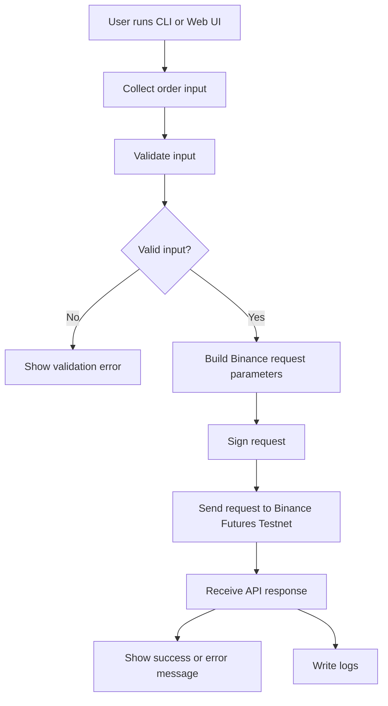
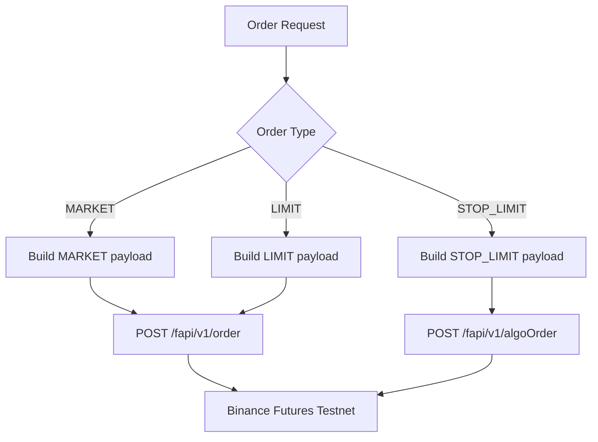
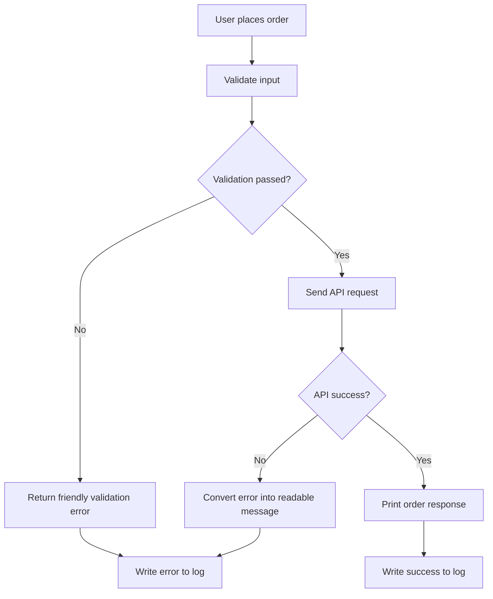

# Binance Futures Testnet Trading Bot

Built by Avni Singhal

A Python-based trading bot for placing orders on the Binance Futures Testnet using Binance REST APIs.

This project focuses on simple order placement, clean CLI usage, input validation, safe credential handling, useful logs, and clear error messages.

> Note: This project uses Binance Futures Testnet only. It does not place real trades and does not use Binance mainnet endpoints.

---

## Table of Contents

- [Setup Steps](#setup-steps)
- [How to Run Examples](#how-to-run-examples)
- [Assumptions](#assumptions)
- [How the Bot Works](#how-the-bot-works)
- [Flow Charts](#small-flow-charts)
- [Supported Order Types](#supported-order-types)
- [Project Structure](#project-structure)
- [Logging](#logging)
- [Error Handling](#error-handling)
- [Security Notes](#security-notes)
- [Development Checks](#development-checks)

---

## Setup Steps

### 1. Prerequisites

Before running the project, make sure you have:

- Python 3 installed
- A Binance Futures Testnet account
- Binance Futures Testnet API key and secret
- Testnet balance available in your Binance Futures Testnet account

---

### 2. Clone or Open the Project

If cloning from GitHub:

```bash
git clone https://github.com/avnisinghal001/PrimeTrade-ai
cd PrimeTradeai
````

If the project is already downloaded, open the project folder in VS Code or terminal.

---

### 3. Create a Virtual Environment

For Windows PowerShell:

```bash
python -m venv .venv
.venv\Scripts\activate
```

For macOS/Linux:

```bash
python3 -m venv .venv
source .venv/bin/activate
```

---

### 4. Install Dependencies

```bash
pip install -r requirements.txt
```

---

### 5. Configure API Credentials

Create a local `.env` file in the project root.

You can copy the example file:

For Windows:

```bash
copy .env.example .env
```

For macOS/Linux:

```bash
cp .env.example .env
```

Then add your Binance Futures Testnet credentials:

```env
BINANCE_API_KEY=your_testnet_api_key_here
BINANCE_API_SECRET=your_testnet_api_secret_here
```

Do not commit the `.env` file to GitHub.

---

## How to Run Examples

### Show Help

```bash
python cli.py --help
```

---

### Place a MARKET Order

```bash
python cli.py --symbol BTCUSDT --side BUY --type MARKET --quantity 0.001
```

This places a market buy order on Binance Futures Testnet.

---

### Place a LIMIT Order

```bash
python cli.py --symbol BTCUSDT --side SELL --type LIMIT --quantity 0.001 --price 120000
```

A LIMIT order can return `NEW` if it is accepted but not immediately filled.

---

### Place a STOP_LIMIT Order

```bash
python cli.py --symbol BTCUSDT --side SELL --type STOP_LIMIT --quantity 0.001 --price 76000 --stop-price 76500
```

For a SELL STOP_LIMIT order, the stop price should usually be below the current market price.

For a BUY STOP_LIMIT order, the stop price should usually be above the current market price.

---

### Run Guided CLI Mode

```bash
python cli.py --interactive
```

This mode asks for order details step by step:

* symbol
* side
* order type
* quantity
* price, if required
* stop price, if required

---

### Run the Local Web UI

```bash
python ui.py
```

Then open:

```txt
http://127.0.0.1:8000
```

Keep the terminal open while using the UI.

Press `Ctrl + C` to stop the server.

---

## Assumptions

This project assumes:

* The user has valid Binance Futures Testnet API credentials.
* The bot is only used with Binance Futures Testnet.
* The user has enough testnet balance before placing orders.
* MARKET and LIMIT orders are sent to the normal Futures order endpoint.
* STOP_LIMIT orders are sent to the Binance Futures Algo Order API.
* This project is built for assignment/demo purposes, not real trading.
* The `.env` file is created locally and is not pushed to GitHub.
* Binance API responses may vary depending on market price, account state, testnet balance, symbol rules, or testnet availability.

---

## How the Bot Works

The project is divided into small layers so each part has a clear responsibility.

### 1. CLI Layer

`cli.py` handles command-line input.

It supports:

* normal command-based order placement
* guided interactive mode using `--interactive`

---

### 2. Web UI Layer

`ui.py` provides a lightweight local browser UI.

It allows users to place:

* MARKET orders
* LIMIT orders
* STOP_LIMIT orders

without typing full CLI commands.

---

### 3. Validation Layer

`validators.py` checks user input before sending requests to Binance.

It validates:

* symbol
* side
* order type
* quantity
* price
* stop price

This helps catch simple mistakes before making API calls.

---

### 4. Order Layer

`orders.py` prepares Binance-compatible request parameters.

It also decides which endpoint should be used:

* MARKET and LIMIT orders use the normal order endpoint
* STOP_LIMIT orders use the algo order endpoint

---

### 5. API Client Layer

`client.py` handles Binance REST API communication.

It is responsible for:

* signing requests
* sending HTTP requests
* handling Binance API responses
* handling network errors
* handling timeout errors
* handling non-JSON responses

---

### 6. Logging Layer

`logging_config.py` configures logging.

Logs are written to:

```txt
logs/trading_bot.log
```

The logs help debug API requests, responses, successful orders, validation failures, and errors.

---

## Flow Charts

### Overall Project Flow



---

### Order Routing Flow



---

### Error Handling Flow



---

## Supported Order Types

| Order Type | Binance Endpoint          | Status           |
| ---------- | ------------------------- | ---------------- |
| MARKET     | `POST /fapi/v1/order`     | Core requirement |
| LIMIT      | `POST /fapi/v1/order`     | Core requirement |
| STOP_LIMIT | `POST /fapi/v1/algoOrder` | Bonus feature    |

---

## Example Output

```txt
Placing MARKET BUY order for BTCUSDT...

ORDER REQUEST SUMMARY
---------------------
symbol: BTCUSDT
side: BUY
type: MARKET
quantity: 0.001
newOrderRespType: RESULT

ORDER RESPONSE
--------------
orderId: 13171419874
status: FILLED
executedQty: 0.0010
avgPrice: 77708.300000

SUCCESS: Order placed on Binance Futures Testnet.
```

---

## Project Structure

```txt
PrimeTradeai/
├── bot/
│   ├── __init__.py
│   ├── client.py              # Binance REST API client, signing, requests and API errors
│   ├── orders.py              # Order payload building and endpoint routing
│   ├── validators.py          # Input validation and ValidationError
│   └── logging_config.py      # Log file setup
│
├── logs/
│   ├── .gitkeep
│   └── trading_bot.log        # Generated runtime logs
│
├── cli.py                     # CLI entry point and interactive mode
├── ui.py                      # Lightweight local web UI
├── .env.example               # Example environment variables
├── .gitignore                 # Ignores .env, venv and cache files
├── requirements.txt           # Python dependencies
└── README.md                  # Project documentation
```

---

## Logging

Logs are written to:

```txt
logs/trading_bot.log
```

The bot logs:

* API request method
* API endpoint
* request parameters
* API response status
* API response body preview
* successful order placements
* validation errors
* Binance API errors
* network errors
* timeout errors
* UI order errors

Sensitive request signatures are redacted in logs.

Example:

```txt
signature: ***REDACTED***
```

---

## Error Handling

The project handles common errors and shows readable messages.

| Error                                        | Meaning                                | Fix                                   |
| -------------------------------------------- | -------------------------------------- | ------------------------------------- |
| Price is required for LIMIT orders           | Missing limit price                    | Add `--price`                         |
| Stop price is required for STOP_LIMIT orders | Missing trigger price                  | Add `--stop-price`                    |
| Order would immediately trigger              | Stop price is already crossed          | Use a valid trigger price             |
| Missing credentials                          | API key or secret not loaded           | Check `.env` or environment variables |
| Cannot reach Binance Testnet                 | Network or API issue                   | Check internet and retry              |
| Limit price rejected                         | Binance price rules rejected the order | Use a price closer to market          |

The UI also converts some raw Binance errors into friendlier explanations.

---

## Security Notes

* API credentials are loaded from `.env` or environment variables.
* `.env` is ignored by git.
* `.env.example` only contains placeholder values.
* Request signatures are redacted from logs.
* The project uses Binance Futures Testnet only.
* No real Binance mainnet endpoint is used.

The Binance HTTP client also ignores system proxy variables to avoid local proxy issues:

```python
self._session.trust_env = False
```

---

## Development Checks

### Check Python Syntax

```bash
python -B -c "import ast, pathlib; [ast.parse(p.read_text(encoding='utf-8'), filename=str(p)) for p in pathlib.Path('.').rglob('*.py') if '.git' not in p.parts]; print('syntax ok')"
```

---

### Check Credentials Are Loaded

```bash
python -B -c "import cli; key, secret = cli.get_credentials(); print('Credentials loaded:', bool(key), bool(secret))"
```

---

### View Logs on Windows

```bash
Get-Content logs\trading_bot.log
```

---

### Check Files Before Submission

```bash
git status --short
```

Make sure `.env` is not listed before pushing to GitHub.

---

## Final Note

This project was built to demonstrate clean Binance Futures Testnet integration with a simple CLI, guided interactive mode, local web UI, input validation, logging, error handling, and safe credential management.
