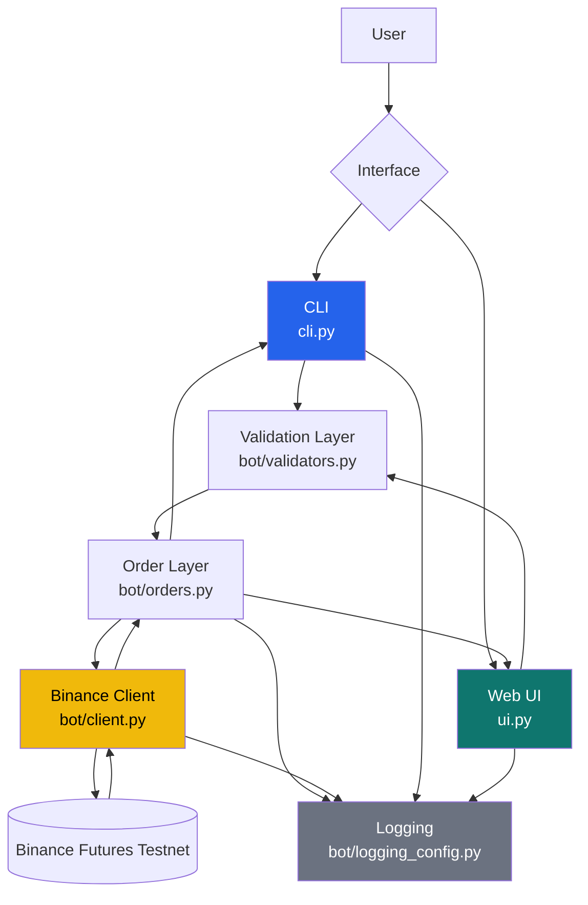
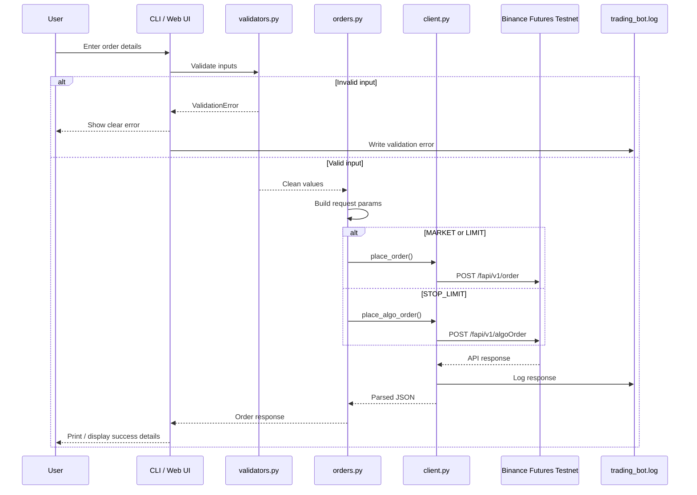
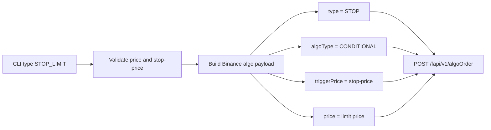
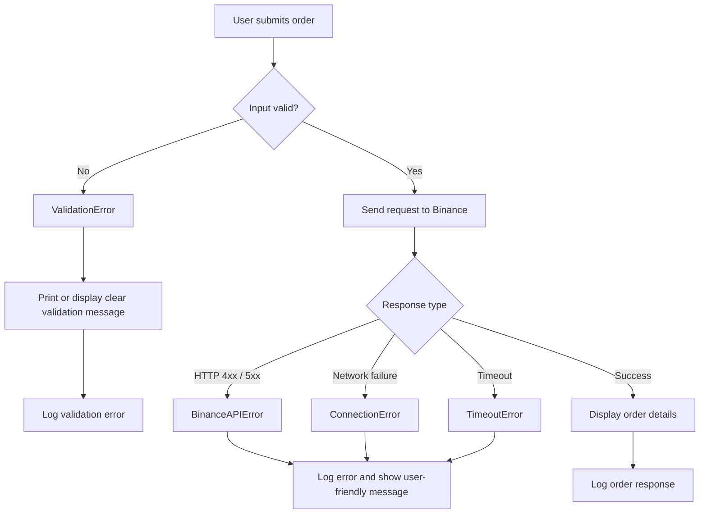

# Binance Futures Testnet Trading Bot

> **Built by [Avni Singhal](https://www.linkedin.com/in/avnisinghal001)**

[](https://www.python.org/)
[](https://testnet.binancefuture.com)
[](https://requests.readthedocs.io/)
[](https://docs.python.org/3/library/argparse.html)

---

⚠️ **Note:** This project uses the **Binance Futures Testnet** only. It requires valid testnet API credentials. Real API keys should never be committed.

Create a local `.env` file in the project root using `.env.example`:

```env
BINANCE_API_KEY=your_testnet_api_key_here
BINANCE_API_SECRET=your_testnet_api_secret_here
```

---

## 📍 Table of Contents

- [Project Overview](#-project-overview)
- [System Architecture](#-system-architecture)
- [Order Flow](#-order-flow)
- [Tech Stack](#-tech-stack)
- [Features](#-features)
- [Project Structure](#-project-structure)
- [Setup & Installation](#️-setup--installation)
- [Configuration](#️-configuration)
- [Usage](#-usage)
- [Logging](#-logging)
- [Error Handling](#-error-handling)
- [Security](#-security)

---

## ⭐ Project Overview

### The Objective

This project is a simplified Python trading bot that places orders on **Binance Futures Testnet (USDT-M)** using Binance REST APIs.

It focuses on:

- Correct Binance Futures Testnet order placement
- Clean separation between CLI, API client, validation and order logic
- Useful logging of requests, responses and errors
- Clear user-facing output for success and failure cases
- Minimal bonus features without overcomplicating the assignment

### Supported Orders

| Order Type | Endpoint | Status |
|---|---|---|
| `MARKET` | `POST /fapi/v1/order` | Core requirement |
| `LIMIT` | `POST /fapi/v1/order` | Core requirement |
| `STOP_LIMIT` | `POST /fapi/v1/algoOrder` | Bonus |

### Bonus Features Included

- Third order type: `STOP_LIMIT`
- Enhanced CLI UX with guided prompts: `python cli.py --interactive`
- Lightweight local web UI: `python ui.py`

---

## ⭐ System Architecture



### Architecture Layers

1. **Interface Layer**
   - `cli.py`: direct command-line usage and guided prompt mode
   - `ui.py`: local browser-based form for placing orders

2. **Validation Layer**
   - Validates symbol, side, order type, quantity, price and stop price
   - Provides clear validation errors before API calls

3. **Order Layer**
   - Builds Binance-compatible request parameters
   - Routes normal orders and algo orders to the correct client method

4. **API Client Layer**
   - Signs Binance REST requests
   - Sends requests to Binance Futures Testnet
   - Handles API, network, timeout and non-JSON response errors

5. **Logging Layer**
   - Logs requests, responses, order placement and errors to `logs/trading_bot.log`

---

## ⭐ Order Flow

### CLI / UI Order Placement



### STOP_LIMIT Routing



---

## ⭐ Tech Stack

### Language & Runtime

- **Python 3.x**
- **Standard Library**
  - `argparse`
  - `http.server`
  - `hmac`
  - `hashlib`
  - `logging`
  - `decimal`

### External Dependency

```text
requests>=2.31.0
```

### APIs

- Binance Futures Testnet base URL:

```text
https://testnet.binancefuture.com
```

- Normal order endpoint:

```text
POST /fapi/v1/order
```

- Algo order endpoint for `STOP_LIMIT`:

```text
POST /fapi/v1/algoOrder
```

---

## ⭐ Features

### 1. MARKET Orders

Places instant buy/sell futures testnet orders.

```powershell
python cli.py --symbol BTCUSDT --side BUY --type MARKET --quantity 0.001
```

Expected successful output includes:

- `orderId`
- `status`
- `executedQty`
- `avgPrice`

### 2. LIMIT Orders

Places buy/sell limit orders with `timeInForce=GTC`.

```powershell
python cli.py --symbol BTCUSDT --side SELL --type LIMIT --quantity 0.001 --price 120000
```

Note: A limit order can return `status: NEW` with `executedQty: 0.0000` if it is accepted but not immediately filled.

### 3. STOP_LIMIT Orders

Places conditional stop-limit orders through the Binance Futures Algo Order API.

```powershell
python cli.py --symbol BTCUSDT --side SELL --type STOP_LIMIT --quantity 0.001 --price 76000 --stop-price 76500
```

Rule of thumb:

- `SELL STOP_LIMIT`: stop price should usually be below current market price
- `BUY STOP_LIMIT`: stop price should usually be above current market price

If Binance returns `Order would immediately trigger`, the trigger price is already crossed by the market.

### 4. Guided CLI Mode

Interactive prompt mode for easier order entry:

```powershell
python cli.py --interactive
```

The app asks for:

- symbol
- side
- order type
- quantity
- price if required
- stop / trigger price if required

### 5. Lightweight Web UI

Run a local browser UI:

```powershell
python ui.py
```

Open:

```text
http://127.0.0.1:8000
```

The UI supports:

- MARKET
- LIMIT
- STOP_LIMIT
- clear success/error messages
- terminal-side console logs for UI actions

---

## ⭐ Project Structure

```text
PrimeTradeai/
├── bot/
│   ├── __init__.py
│   ├── client.py              # Binance REST API client, signing, requests, API errors
│   ├── orders.py              # Order parameter building and endpoint routing
│   ├── validators.py          # Input validation and ValidationError
│   └── logging_config.py      # Rotating log file setup
│
├── logs/
│   ├── .gitkeep
│   └── trading_bot.log        # Generated API request/response/error logs
│
├── cli.py                     # CLI entry point and interactive prompt mode
├── ui.py                      # Lightweight local web UI
├── .env.example               # Example credential variable names
├── .gitignore                 # Ignores .env, venv, cache files
├── requirements.txt           # Python dependencies
└── README.md                  # Project documentation
```

---

## ⭐ Setup & Installation

### Prerequisites

- Python 3.x
- Binance Futures Testnet account
- Binance Futures Testnet API key and secret

### Step 1: Clone / Open Project

```powershell
cd C:\Users\avnis\OneDrive\Desktop\PrimeTradeai\PrimeTradeai
```

### Step 2: Create Virtual Environment

```powershell
python -m venv .venv
.venv\Scripts\activate
```

### Step 3: Install Dependencies

```powershell
pip install -r requirements.txt
```

### Step 4: Create Binance Testnet Credentials

1. Go to [Binance Futures Testnet](https://testnet.binancefuture.com)
2. Log in or create a testnet account
3. Generate API key and secret from API Management
4. Add testnet funds if needed

---

## ⭐ Configuration

### Option 1: Use `.env`

Copy `.env.example` to `.env`:

```powershell
copy .env.example .env
```

Edit `.env`:

```env
BINANCE_API_KEY=your_testnet_api_key_here
BINANCE_API_SECRET=your_testnet_api_secret_here
```

### Option 2: Use PowerShell Environment Variables

```powershell
$env:BINANCE_API_KEY = "your_testnet_api_key"
$env:BINANCE_API_SECRET = "your_testnet_api_secret"
```

### Security Note

`.env` is ignored by git and must not be committed.

---

## ⭐ Usage

### Show Help

```powershell
python cli.py --help
```

### MARKET Order

```powershell
python cli.py --symbol BTCUSDT --side BUY --type MARKET --quantity 0.001
```

### LIMIT Order

```powershell
python cli.py --symbol BTCUSDT --side SELL --type LIMIT --quantity 0.001 --price 120000
```

### Marketable LIMIT Order Example

If BTCUSDT is around `77000`, this BUY limit may fill immediately:

```powershell
python cli.py --symbol BTCUSDT --side BUY --type LIMIT --quantity 0.001 --price 80000
```

### STOP_LIMIT Order

```powershell
python cli.py --symbol BTCUSDT --side SELL --type STOP_LIMIT --quantity 0.001 --price 76000 --stop-price 76500
```

### Interactive CLI

```powershell
python cli.py --interactive
```

### Web UI

```powershell
python ui.py
```

Open:

```text
http://127.0.0.1:8000
```

Keep the terminal open while using the UI. Press `Ctrl+C` to stop the server.

---

## ⭐ Example Output

```text
Placing MARKET BUY order for BTCUSDT...

ORDER REQUEST SUMMARY
---------------------
symbol: BTCUSDT
side: BUY
type: MARKET
quantity: 0.001
newOrderRespType: RESULT

ORDER RESPONSE
--------------
orderId: 13171419874
status: FILLED
executedQty: 0.0010
avgPrice: 77708.300000

SUCCESS: Order placed on Binance Futures Testnet.
```

---

## ⭐ Logging

Logs are written to:

```text
logs/trading_bot.log
```

Logged events include:

- API request method, endpoint and parameters
- API response status and response body preview
- successful order placements
- validation failures
- Binance API errors
- network and timeout errors
- UI order errors

### Sensitive Data Handling

The request signature is redacted in logs:

```text
signature: ***REDACTED***
```

---

## ⭐ Error Handling

### Error Flow



### Common Errors

| Error | Meaning | Fix |
|---|---|---|
| `Price is required for LIMIT orders` | Missing `--price` | Add `--price` |
| `Stop price is required for STOP_LIMIT orders` | Missing trigger price | Add `--stop-price` |
| `Order would immediately trigger` | Stop price is already crossed | Use a future trigger price |
| `Limit price can't be higher...` | Binance price protection rejected price | Use a valid price closer to market |
| `Cannot reach Binance Testnet` | Network issue | Check internet / try again |
| Missing credentials | API key/secret not loaded | Configure `.env` or PowerShell vars |

### UI Error Messages

The UI converts raw Binance errors into friendly explanations. For example:

```text
Your SELL STOP_LIMIT would trigger immediately.
Use a stop/trigger price below the current market price...
```

The terminal still prints the raw error for debugging.

---

## ⭐ API Request Examples

### MARKET Payload

```python
{
    "symbol": "BTCUSDT",
    "side": "BUY",
    "type": "MARKET",
    "quantity": "0.001",
    "newOrderRespType": "RESULT"
}
```

### LIMIT Payload

```python
{
    "symbol": "BTCUSDT",
    "side": "SELL",
    "type": "LIMIT",
    "quantity": "0.001",
    "price": "120000",
    "timeInForce": "GTC",
    "newOrderRespType": "RESULT"
}
```

### STOP_LIMIT Payload

```python
{
    "symbol": "BTCUSDT",
    "side": "SELL",
    "type": "STOP",
    "quantity": "0.001",
    "price": "76000",
    "triggerPrice": "76500",
    "timeInForce": "GTC",
    "algoType": "CONDITIONAL",
    "newOrderRespType": "RESULT"
}
```

---

## ⭐ Security

### Credential Safety

- API credentials are read from `.env` or environment variables
- `.env` is ignored by git
- `.env.example` contains placeholders only
- Request signatures are redacted from logs

### Network Safety

The Binance HTTP client ignores system proxy variables:

```python
self._session.trust_env = False
```

This prevents broken local proxy settings from blocking Binance requests.

### Testnet Only

All requests use:

```text
https://testnet.binancefuture.com
```

No mainnet endpoint is used.

---

## ⭐ Development & Checks

### Syntax Check

```powershell
python -B -c "import ast, pathlib; [ast.parse(p.read_text(encoding='utf-8'), filename=str(p)) for p in pathlib.Path('.').rglob('*.py') if '.git' not in p.parts]; print('syntax ok')"
```

### Credential Check

```powershell
python -B -c "import cli; key, secret = cli.get_credentials(); print('Credentials loaded:', bool(key), bool(secret))"
```

### View Logs

```powershell
Get-Content logs\trading_bot.log
```

### Git Check Before Submission

```powershell
git status --short
```

Make sure `.env` is not listed.

---

**Built with ❤️ by Avni Singhal**
